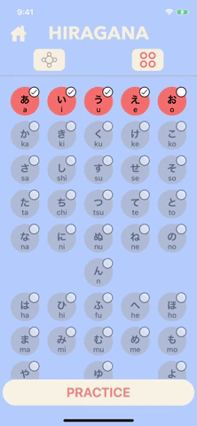

# Nukon
studying Japanese ios App for English Speaker

## Introduction

## Features

A few things you can do with Nukon:
- study and learn japanese characters (hiragana and katakana) and their pronounciation
- keep track your confort level for each character
- practice pronounciation each character
- listen to your pronounciation and give you visual feedback

### Voice Recognition for pronunciation

