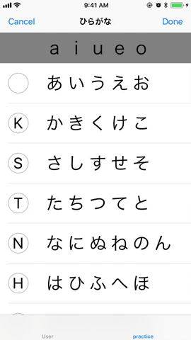

# Nukon
studying Japanese ios App for English Speaker

## Introduction

## Features

A few things you can do with Nukon:
- review what Japanese word you have learned.
- review how many Japanese word you have learned.
- practice how to write Japanese characters.
- practice pronunciation each characters.

### Voice Recognition for pronunciation

